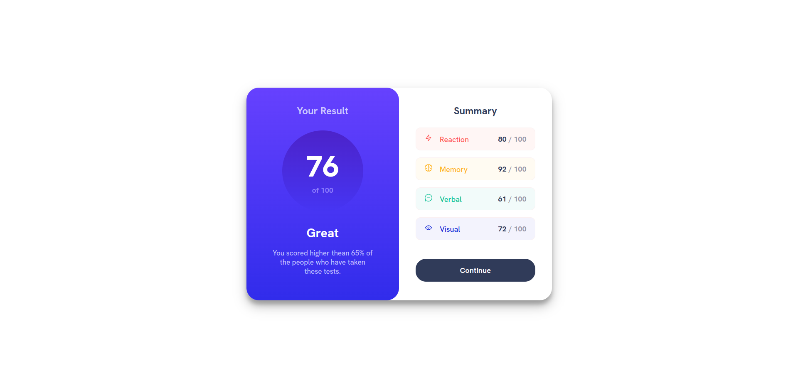

# Frontend Mentor - Results summary component

# Description

Thanks for checking out this front-end coding challenge from the [frontend mentor](https://www.frontendmentor.io/challenges/results-summary-component-CE_K6s0maV). This component is made with ***React***, ***scss*** and ***BEM*** methodology.

I got the colors from the photos in the Design folder using the Color Picker.

## Features

- read data from ***json*** file and calculate average score
- mobile device support